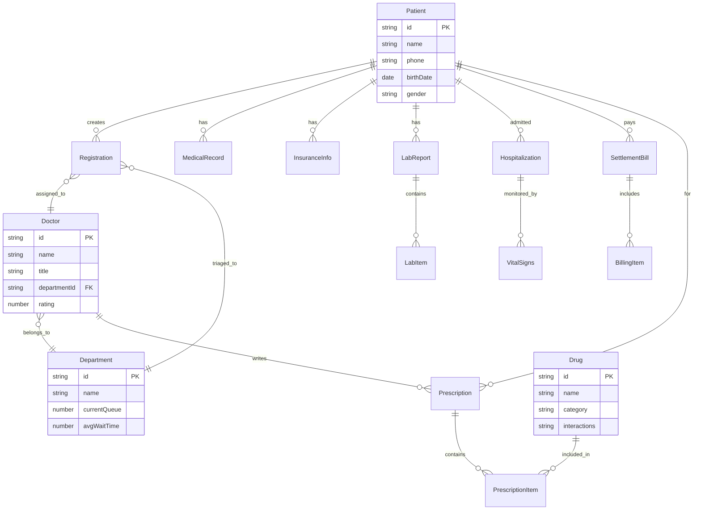

## 1. 架构设计

```mermaid
graph TB
    subgraph "前端层"
        "React + Vite + Tailwind"
        "Zustand 状态管理"
        "React Router 路由"
    end
    subgraph "数据层"
        "Mock API Service"
        "本地模拟数据"
    end
    subgraph "功能模块"
        "挂号与分诊模块"
        "候诊队列模块"
        "处方审核模块"
        "检查报告模块"
        "住院监测模块"
        "药房发药模块"
        "出院结算模块"
        "院长驾驶舱模块"
    end
    "React + Vite + Tailwind" --> "功能模块"
    "Zustand 状态管理" --> "功能模块"
    "功能模块" --> "Mock API Service"
    "Mock API Service" --> "本地模拟数据"
```

## 2. 技术说明

- 前端: React@18 + TailwindCSS@3 + Vite + TypeScript
- 初始化工具: vite-init
- 后端: 无（使用Mock数据模拟）
- 数据库: 无（使用本地模拟数据）

## 3. 路由定义

| 路由 | 用途 |
|------|------|
| /login | 登录页，角色选择 |
| /patient | 患者首页 |
| /patient/register | 患者挂号页（症状+病史+医保+推荐） |
| /patient/queue | 候诊排队页 |
| /patient/reports | 检查报告列表页 |
| /patient/report/:id | 检查报告详情+AI解读页 |
| /patient/settlement | 出院结算页 |
| /medical | 医护首页 |
| /medical/prescription | 处方开具与审核页 |
| /medical/monitor | 住院监测大屏页 |
| /medical/reports | 报告审核页 |
| /admin | 行政首页 |
| /admin/pharmacy | 药房发药管理页 |
| /admin/triage | 导诊管理页 |
| /director | 院长驾驶舱首页 |
| /director/report | 运营月报导出页 |

## 4. API定义（Mock）

### 4.1 挂号相关
```typescript
interface RegistrationRequest {
  patientId: string;
  symptoms: string;
  medicalHistory: File[];
  insuranceCardNo: string;
}

interface DoctorRecommendation {
  doctorId: string;
  name: string;
  department: string;
  title: string;
  rating: number;
  queueLength: number;
  estimatedWait: number;
  availability: 'busy' | 'available' | 'idle';
}

interface RegistrationResponse {
  registrationId: string;
  recommendedDoctors: DoctorRecommendation[];
  triageDepartment: string;
  queueNumber: number;
}
```

### 4.2 候诊队列
```typescript
interface QueueItem {
  queueNumber: number;
  patientName: string;
  department: string;
  doctorName: string;
  status: 'waiting' | 'called' | 'consulting' | 'done';
  estimatedWait: number;
  priority: number;
}

interface QueueState {
  currentNumber: number;
  items: QueueItem[];
  averageWaitTime: number;
}
```

### 4.3 处方审核
```typescript
interface PrescriptionItem {
  drugId: string;
  drugName: string;
  dosage: string;
  frequency: string;
  duration: string;
}

interface ConflictAlert {
  type: 'drug_interaction' | 'allergy';
  severity: 'warning' | 'critical';
  message: string;
  relatedDrugs: string[];
  suggestion: string;
}

interface PrescriptionReview {
  valid: boolean;
  conflicts: ConflictAlert[];
}
```

### 4.4 检查报告
```typescript
interface LabReport {
  reportId: string;
  patientId: string;
  date: string;
  items: LabItem[];
  aiSummary: string;
  abnormalItems: LabItem[];
}

interface LabItem {
  name: string;
  value: number;
  unit: string;
  referenceRange: string;
  isAbnormal: boolean;
  direction: 'high' | 'low' | 'normal';
}
```

### 4.5 住院监测
```typescript
interface VitalSigns {
  patientId: string;
  heartRate: number;
  bloodPressureSys: number;
  bloodPressureDia: number;
  oxygenLevel: number;
  temperature: number;
  timestamp: string;
  isAbnormal: boolean;
  alerts: VitalAlert[];
}

interface VitalAlert {
  type: 'heart_rate' | 'blood_pressure' | 'oxygen' | 'temperature';
  level: 'warning' | 'critical';
  message: string;
  value: number;
  threshold: number;
}
```

### 4.6 药房发药
```typescript
interface DispensingTask {
  taskId: string;
  prescriptionId: string;
  patientName: string;
  drugs: DispensingDrug[];
  status: 'pending' | 'dispensing' | 'scanning' | 'completed';
  robotArmStatus: 'idle' | 'moving' | 'grabbing' | 'placing';
}

interface DispensingDrug {
  drugId: string;
  drugName: string;
  quantity: number;
  barcode: string;
  scanStatus: 'pending' | 'verified' | 'mismatch';
}
```

### 4.7 出院结算
```typescript
interface SettlementBill {
  patientId: string;
  totalAmount: number;
  insuranceCovered: number;
  selfPayAmount: number;
  items: BillingItem[];
}

interface BillingItem {
  category: '检查费' | '药费' | '床位费' | '手术费' | '护理费' | '其他';
  description: string;
  amount: number;
  insuranceCovered: boolean;
  coverageRate: number;
}
```

### 4.8 院长驾驶舱
```typescript
interface DashboardMetrics {
  outpatientCount: number;
  outpatientTrend: number[];
  bedTurnoverRate: number;
  drugRatio: number;
  patientSatisfaction: number;
  departmentMetrics: DepartmentMetric[];
}

interface DepartmentMetric {
  department: string;
  outpatientCount: number;
  bedTurnoverRate: number;
  drugRatio: number;
  satisfaction: number;
}
```

## 5. 数据模型

### 5.1 数据模型定义



### 5.2 数据定义（Mock数据初始化）

项目使用前端Mock数据，数据定义在 `src/mock/` 目录下，包含：
- 患者数据（20条）
- 医生数据（15条，覆盖5个科室）
- 科室数据（5条）
- 药品数据（30条，含相互作用信息）
- 检查报告数据（10条，含异常指标）
- 住院体征数据（实时模拟）
- 结算数据（5条）
- 驾驶舱指标数据
